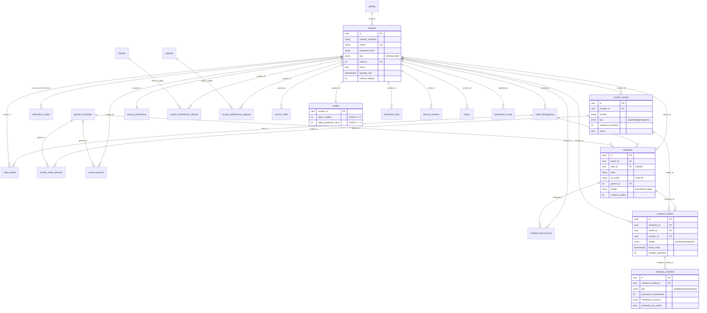

# Esquema de Base de Datos — Resuena

> Modelo relacional definido en la **Fase 02**. Motor: PostgreSQL 16.
> Migraciones: `alembic/versions/0001_initial_schema.py` (esquema) y `0002_seed_defaults.py` (seed).
> ORM: SQLAlchemy 2 async. Modelos en `src/models/`.

---

## Convenciones generales

- **PKs UUID** (`gen_random_uuid()` de pgcrypto) en entidades principales; **PK entera** en catálogos
  con IDs estables (`perfiles`, `generos_musicales`) y **PK natural CHAR(2)** en catálogos ISO
  (`idiomas`, `regiones`). Tablas puente usan **PK compuesta**.
- **Timestamps con timezone** (`TIMESTAMPTZ`). `created_at`/`updated_at` gestionados por la BD.
- **ENUMs nativos** de PostgreSQL para conjuntos cerrados de valores.
- **Nombres de constraints deterministas** vía `naming_convention` (ver `src/models/base.py`):
  `pk_`, `fk_`, `uq_`, `ck_`, `ix_`.
- **JSONB** solo donde la estructura es genuinamente variable (`detalle`, `metodo_pago`, `metadatos_escritura`).

---

## Diagrama ER



---

## Tablas por dominio

### Usuarios y perfiles
| Tabla | Descripción | Notas |
|-------|-------------|-------|
| `perfiles` | Catálogo de roles base (1=Admin, 2=Artista, 3=Curador). | PK entera; seed con IDs fijos. Admin protegido. |
| `usuarios` | Actor principal (artista o curador; admin = perfil 1). | UK `correo`. `blocked_until`+`intentos_fallidos` para anti-fuerza-bruta. |

### Sellos discográficos
| Tabla | Descripción | Notas |
|-------|-------------|-------|
| `sellos_discograficos` | Sello que puede gestionar varios artistas. | `created_by` → usuarios. |
| `sello_artistas` | Puente sello↔artista con rol. | PK compuesta `(sello_id, artista_id)`. |

### Curadores y medios
| Tabla | Descripción | Notas |
|-------|-------------|-------|
| `solicitudes_curador` | Flujo de aprobación admin de curadores. | `estado` enum; `revisor_id` nullable. |
| `curador_medios` | Cada canal/medio independiente del curador. | Las campañas llegan al medio, no al curador. |
| `curador_medio_generos` | Puente medio↔género (especialización). | PK compuesta; reemplaza JSON. |

### Géneros y catálogos
| Tabla | Descripción | Notas |
|-------|-------------|-------|
| `generos_musicales` | Catálogo de géneros. | PK entera; 20 seedeados. |
| `usuario_generos` | Géneros preferidos/excluidos del usuario. | PK compuesta `(usuario_id, genero_id)`. |
| `idiomas` | Catálogo ISO 639-1. | PK `CHAR(2)`; 8 seedeados. |
| `regiones` | Catálogo ISO 3166-1 alpha-2. | PK `CHAR(2)`; 20 seedeadas. |

### Preferencias de onboarding
| Tabla | Descripción | Notas |
|-------|-------------|-------|
| `usuario_preferencias` | Datos progresivos (apertura, idiomas, lanzamientos). | PK = `usuario_id` (1:1). `CHECK apertura_musical 0-100`. |
| `usuario_preferencias_idiomas` | Puente preferencias↔idiomas. | PK compuesta. |
| `usuario_preferencias_regiones` | Puente preferencias↔regiones. | PK compuesta. |
| `usuario_redes` | Redes sociales del perfil. | — |

### Créditos y wallet
| Tabla | Descripción | Notas |
|-------|-------------|-------|
| `wallets` | Saldo del usuario. | PK = `usuario_id`. `CHECK` saldos ≥ 0. Mutaciones con `SELECT FOR UPDATE`. |
| `creditos_transacciones` | Libro mayor append-only de créditos. | Solo `created_at`. `campana_id` nullable. |

### Campañas y envíos
| Tabla | Descripción | Notas |
|-------|-------------|-------|
| `campanas` | Campaña del artista (o del sello). | `url_*` guardan **claves S3**, no URLs. |
| `campana_medios` | Vínculo campaña↔medio específico. | Estado/deadline/crédito por fila. Reemplaza `campana_profesionales`. |

### Entregas y retiros
| Tabla | Descripción | Notas |
|-------|-------------|-------|
| `entregas_contenido` | Entrega del curador para un `campana_medio`. | `metadatos_escritura` JSONB (editor anti-IA). |
| `solicitudes_retiro` | Retiro de saldo del curador. | `metodo_pago` JSONB (CLABE/PayPal/Wise). No loguear. |

### Infraestructura
| Tabla | Descripción | Notas |
|-------|-------------|-------|
| `bitacora_eventos` | Auditoría de acciones críticas. | `detalle` JSONB; `autor_id` nullable (SET NULL). |
| `ips_bloqueadas` | IPs bloqueadas por seguridad. | PK BigInt; UK `ip`. |
| `tokens` | Tokens de un solo uso (registro/reset/confirmación). | UK `token`; consumir con `SELECT FOR UPDATE`. |
| `parametros_config` | Configuración clave/valor. | `valor_cifrado`; `es_secreto`. |

---

## Tipos ENUM

| Tipo PG | Valores | Usado en |
|---------|---------|----------|
| `tipo_usuario` | artista, curador | `usuarios.tipo` |
| `rol_sello_artista` | owner, manager, artista | `sello_artistas.rol` |
| `estado_solicitud_curador` | pendiente, aprobada, rechazada | `solicitudes_curador.estado` |
| `tipo_medio` | playlist, blog, instagram, tiktok, youtube, facebook, twitter, radio, website, eventos, otro | `curador_medios.tipo` |
| `tipo_preferencia_genero` | preferido, excluido | `usuario_generos.tipo` |
| `tipo_lanzamientos` | nuevos, post, ambos | `usuario_preferencias.tipo_lanzamientos` |
| `tipo_red_social` | spotify, instagram, youtube, tiktok, facebook, twitter, soundcloud, bandcamp, website, otro | `usuario_redes.tipo` |
| `tipo_transaccion_credito` | compra, gasto, devolucion, retiro | `creditos_transacciones.tipo` |
| `estado_campana` | borrador, enviada, en_revision, completada, cancelada | `campanas.estado` |
| `estado_campana_medio` | pendiente, aceptada, rechazada, entregada, expirada | `campana_medios.estado` |
| `tipo_entrega` | blog, playlist, reel, link, post | `entregas_contenido.tipo` |
| `estado_solicitud_retiro` | pendiente, aprobada, rechazada, pagada | `solicitudes_retiro.estado` |
| `tipo_token` | registro, reset, confirmacion_email | `tokens.tipo` |

---

## Reglas de integridad referencial (ON DELETE)

| Comportamiento | Relaciones | Racional |
|----------------|------------|----------|
| **CASCADE** | sello_artistas, solicitudes_curador(usuario), curador_medios, curador_medio_generos, usuario_generos, usuario_preferencias(+puentes), usuario_redes, wallets, campana_medios(campana), entregas_contenido, tokens | Datos dependientes que no tienen sentido sin su padre. |
| **RESTRICT** | usuarios→perfiles, sellos→usuarios(created_by), campanas→usuarios(artista), campanas→generos, campana_medios→curador_medios/usuarios, creditos→usuarios, solicitudes_retiro→curador, *_generos→generos, preferencias_*→idiomas/regiones | Protege catálogos y entidades financieras: no se borra un padre con dependientes. |
| **SET NULL** | solicitudes_curador.revisor_id, campanas.sello_id, creditos.campana_id, bitacora.autor_id, parametros_config.updated_by | La referencia es opcional; al borrar el padre se conserva el registro histórico. |

---

## Índices

Además de los implícitos (PK, UK), la migración crea:

| Índice | Tabla | Columnas | Tipo |
|--------|-------|----------|------|
| `idx_bitacora_autor` | bitacora_eventos | (autor_id, created_at DESC) | — |
| `idx_bitacora_entidad` | bitacora_eventos | (entidad, entidad_id, created_at DESC) | — |
| `idx_campanas_artista` | campanas | (artista_id, estado) | — |
| `idx_campanas_estado` | campanas | (estado) | — |
| `idx_campana_medios_curador` | campana_medios | (curador_id, estado) | — |
| `idx_campana_medios_campana` | campana_medios | (campana_id) | — |
| `idx_campana_medios_fecha` | campana_medios | (fecha_limite) | **parcial** `WHERE estado='pendiente'` |
| `idx_creditos_usuario` | creditos_transacciones | (usuario_id, created_at DESC) | — |
| `idx_tokens_expires` | tokens | (expires_at) | **parcial** `WHERE consumed_at IS NULL` |
| `idx_ips_blocked_until` | ips_bloqueadas | (blocked_until) | — |
| `idx_sol_curador_usuario` | solicitudes_curador | (usuario_id, estado) | — |
| `ix_curador_medios_curador_id` | curador_medios | (curador_id) | FK helper |
| `ix_usuario_redes_usuario_id` | usuario_redes | (usuario_id) | FK helper |
| `ix_entregas_contenido_campana_medio_id` | entregas_contenido | (campana_medio_id) | FK helper |

---

## Operación de migraciones

```bash
docker compose exec api alembic upgrade head      # aplicar
docker compose exec api alembic downgrade base     # revertir todo
docker compose exec api alembic current            # versión actual
docker compose exec api alembic history            # historial
```

> **Nota:** el `downgrade` de `0001` elimina explícitamente los 13 tipos ENUM nativos
> (PostgreSQL no los borra con `DROP TABLE`), de modo que el ciclo
> `downgrade base → upgrade head` es idempotente y no falla con "type already exists".
